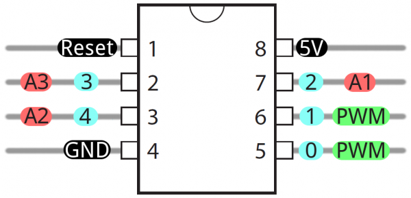

# Automatic Plant Watering System

The idea is to have a device that would activate a pump to water the
plants from time to time. Not that I dislike the task every morning, it
was more of a matter of keeping the plants alive when I travel with my
wife (but getting rid of the morning task was definitely a plus
:smiley:).

Just another one of the same (you can find tons of similar projects
over the web), but I've decided to do it from scratch to learn
something new on this project.

The device will be an automatic plant watering system that will
basically activate a pump to water the plants from time to time.

## Project Requisites

Besides the basic function, I want to have some additional features on
the device:

- on/off lever
  - toggle switch 😍
  - on/off LED (green LED)
- water level control
  - To avoid problems with the pump I want to keep track of a minimum
    water level. The system should stop if the water level is below
    the minimum treshold.
  - This water level control uses a liquid level floating switch
    installed on the side of a bucket that is my water reservoir.
  - A red LED must turn on when the water level is below the minimum.
- reset button
  - The reset button must reset the time counter and perform an
    immediate watering.
- time interval options
  - The interval between two waterings are set via a potentiometer
    (intervals of 3h, 6h, 12h, 24h).
- pumping time options
  - The time the pump is on is also controlled by a potentiometer (the
    options here are 30s, 60s, 90s and, 120s).
  - A yellow LED must be turned on every time the pump is activated.
- 3A fuse
  - The system must have a fuse to protect it from power surges.

## ATTiny85

As the electronic is quite simple, I didn't want to spend an Arduino
Uno on the project, so I've decided to use a ATTiny85 that I already
had to control the system. The ATTiny85 is small, consumes very little
energy, it has internal analog to digital converters (you can use
`analogRead()`), and can be programmed using the Arduino Uno I have.

### Useful Data

- 10-bit analog to digital converter in pins PB2, PB3, and PB4
- system reset is activated by a low level on the reset pin

quantity | minimum | maximum
---------|---------|--------
voltage  |    2.7V |    5.5V

## References

I'm using an Arduino shield to program the ATTiny85 that I've build
following the tutorial from Arjun Ganesan that can be found
[here](https://create.arduino.cc/projecthub/arjun/programming-attiny85-with-arduino-uno-afb829).